# しゃなりしゃなり インフラストラクチャ

しゃなりしゃなりのインフラ部分を構築/管理する

# ローカル開発環境


以下の開発ツールを準備する

- [Visual Studio Code](https://azure.microsoft.com/ja-jp/products/visual-studio-code)
- [Docker Desktop](https://www.docker.com/ja-jp/products/personal/)
  - 個人開発のため
  - Kubernetes のプラグインを有効にする
- kubectl
  - Docker Desktop がインストール済みの場合は自動でインストールされている
- argocd CLI
  - Mac の場合は`brew install argocd`でインストールする

## 実行手順

### ArgoCD の起動停止

ローカル PC 上に ArgoCD を起動する。
以下の手順で ArgoCD を起動する

```
kubectl create namespace argocd
kubectl apply -n argocd -f https://raw.githubusercontent.com/argoproj/argo-cd/stable/manifests/install.yaml
kubectl patch svc argocd-server -n argocd -p '{"spec": {"type": "LoadBalancer"}}'
```

Web Server にアクセスする際は、別のターミナルを立ち上げて、以下を実行しておく

```
kubectl port-forward svc/argocd-server -n argocd 8080:443
```

アクセス後は、username: `admin`とパスワードは下記の実行結果より生成されたものを入力してログインする。

```
argocd admin initial-password -n argocd
```

以下のコマンドで argocd に application をデプロイする

```
kubectl apply -n argocd -f local/argocd/application.yaml
```

停止、削除する場合は以下を実行する。

```
kubectl delete -n argocd -f local/argocd/application.yaml
kubectl delete -n argocd -f https://raw.githubusercontent.com/argoproj/argo-cd/stable/manifests/install.yaml
kubectl delete namespace argocd
```

### 起動

以下のコマンドを実行してローカル PC 上の Kubernetes でアプリケーションを起動します。

```bash
$ kubectl apply -k ./kustomize/base/
```

```bash
$ kubectl delete -k ./kustomize/base/
```

`http://localhost`でアクセスできます。  
新しい Image を作成した場合は、各 deployment.yaml のバージョンを変更します。  
ToDo: 自動でバージョンを変更するか、実行時に引数として渡せるかの対応を検討する

### 停止

以下のコマンドを実行してローカル PC 上の Kubernetes でアプリケーションを停止します。

```bash
$ kubectl delete -f local -R
```

以下のコマンドでコンテキストの切り替えを実施する。

- 一覧表示

```bash
$ kubectl config get-contexts
```

- 切り替え

```bash
$ kubectl config use-context <Clustername>
```

# GCP 環境


※把握できたら更新する

※Workflow+OpenTofu のみで現状セットアップが完了していないので、以下の追加対応をローカル PC から実施する。

1. GKE と認証する

   ```bash
   $ gcloud container clusters get-credentials <CLUSTER NAME> --region <REGION>     --project <PROJECT NAME>
   ```

1. ポートフォーワードの設定をする

   ```bash
   $ kubectl port-forward service/argo-cd-argocd-server -n argocd 8080:443
   ```

1. ArgoCD のパスワードを生成する

   ```bash
   kubectl -n argocd get secret argocd-initial-admin-secret -o jsonpath="{.data.    password}" | base64 -d
   ```

1. `localhost:8080`でアクセスする。username は初期は`admin`、パスワードは上記で生成されたもの。
