# しゃなりしゃなり インフラストラクチャ

しゃなりしゃなりのインフラ部分を構築/管理する

# ローカル開発環境


# GCP 環境


※把握できたら更新する

※Workflow+OpenTofu のみで現状セットアップが完了していないので、以下の追加対応をローカル PC から実施する。

1. GKE と認証する

   ```bash
   $ gcloud container clusters get-credentials <CLUSTER NAME> --region <REGION> --project <PROJECT NAME>
   ```

1. ArgoCD に GKE クラスターを登録する
   ```bash
   $ kubectl config get-contexts -o name
   $ argocd cluster add <TARGET CONTEXT>
   ```

## コンテキスト(接続先の Kuberenetes)の切り替え

以下のコマンドでコンテキストの切り替えを実施する。

- 一覧表示

```bash
$ kubectl config get-contexts
```

- 切り替え

```bash
$ kubectl config use-context <Clustername>
```
